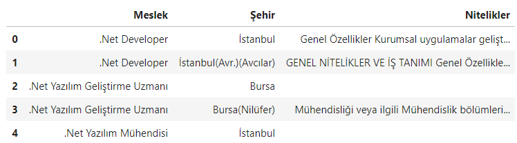
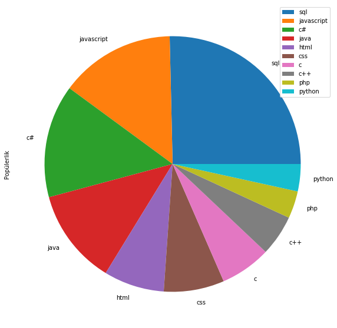
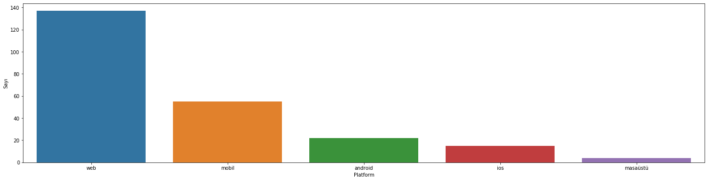

# BilgisayarBilimleriSektorBeklentileri
İnternet üzerinde bulunan iş ilanlarını inceleyerek bilgisayar bilimleri altında çalışan yazılımcılardan neler beklendiğini inceledim.

## Veri Seti
24.07.2020 tarihinde internet üzerinde yayında olan bilgisayar-yazılım mühendisi gibi bilgisayar bilimleri 
pozisyonlarına ait 392 ilanın verisini çektim.

Veri seti Meslek-Şehir-Nitelikler olarak 3 farklı sütundan oluşmaktadır.

## Proje İçinde İşlenen Sorular

İş ilanlarından yola çıkarak şu soruları cevapladım:

* Hangi şehirlerde daha fazla iş ilanı var?
* Hangi programlama dilleri daha fazla talep ediliyor?
* Hangi frameworkler daha fazla talep ediliyor?
* Hangi veri tabanları daha fazla talep ediliyor?
* Firmalar kaç yıl tecrübe talep ediyor?
* Hangi platformlar daha çok talep ediliyor?

##### Yukarıdaki soruların cevaplarını bulduktan sonra
şöyle grafikler elde ettim:

